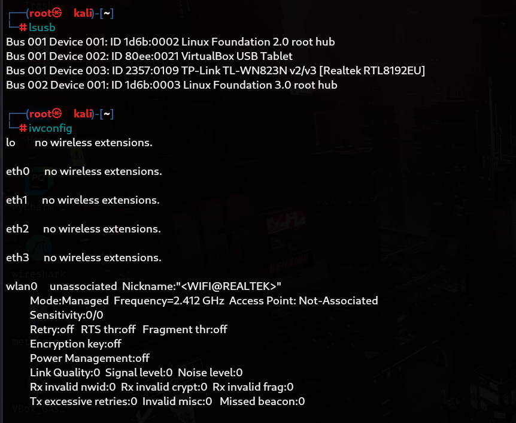
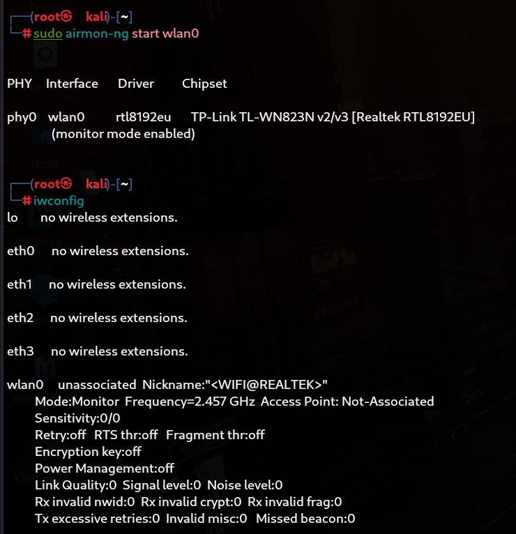
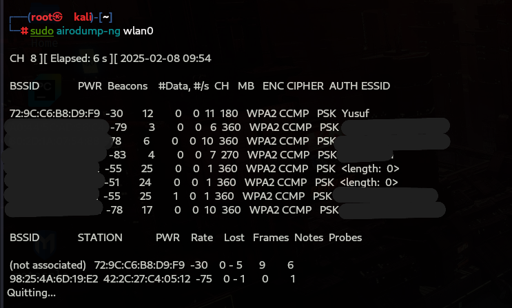
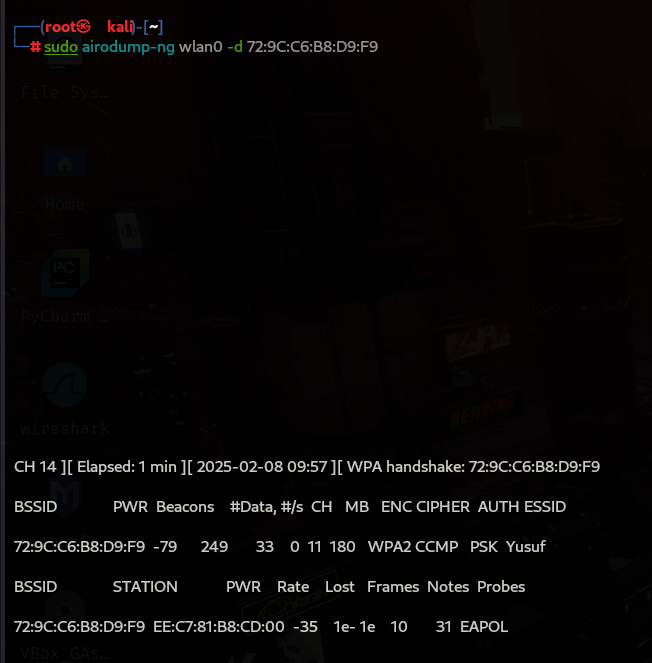
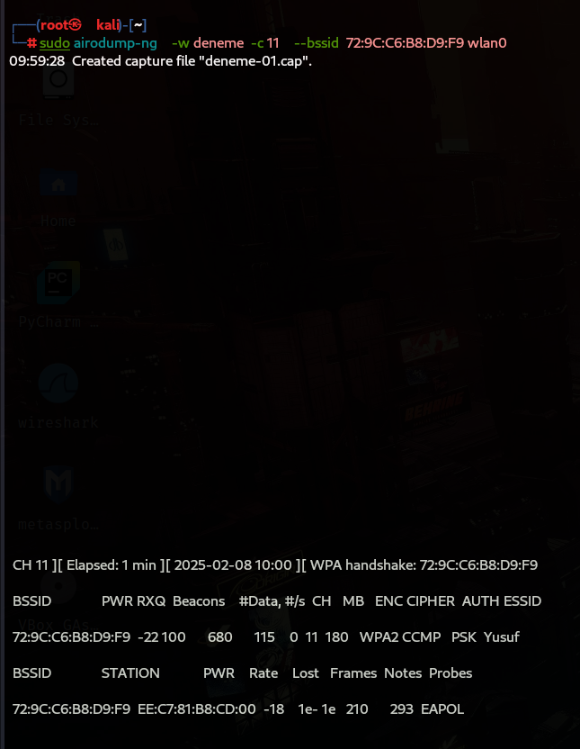
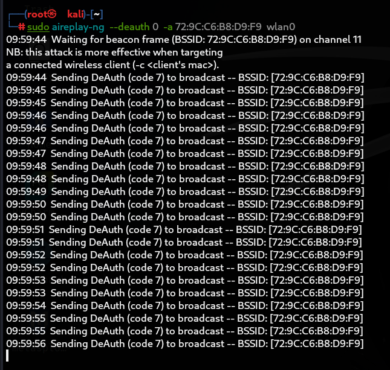
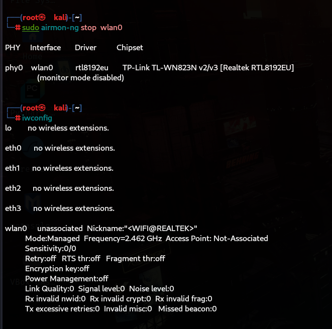
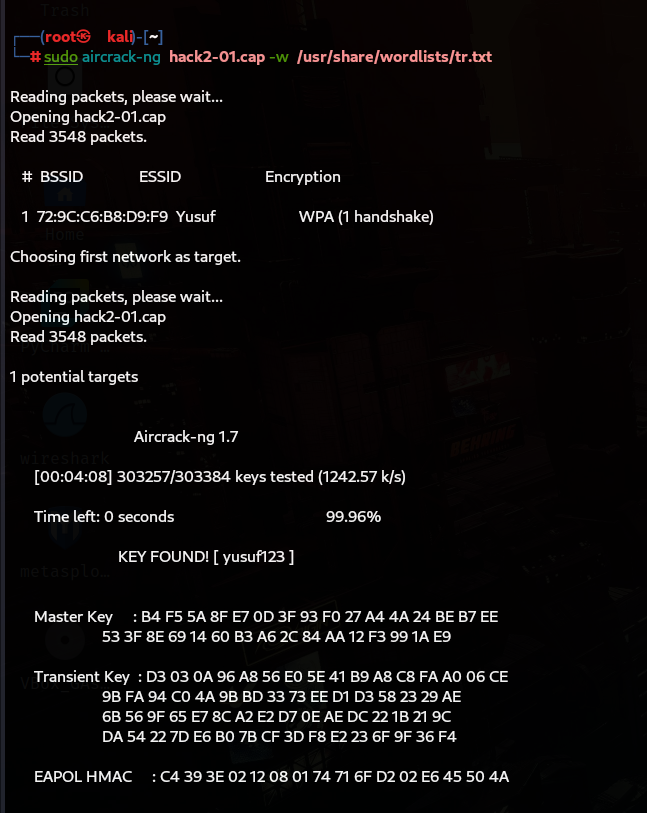

## İçindekiler
1. [Giriş](#giriş)
2. [Gerekli Araçlar](#gerekli-araçlar)
3. [Adım 1: Ağ Analizi](#adım-1-ağ-analizi)
4. [Adım 2: Paket Toplama](#adım-2-paket-toplama)
5. [Adım 3: Şifre Kırma](#adım-3-şifre-kırma)
6. [Sonuç](#sonuç)

## Adım 1: Ağ Analizi ve USB ağ kartı
İlk olarak, usb ağ kartımızın sistem tarafından tanınıp tanınmadığını görmek için "lsusb" komutunu çalıştırıyoruz. Ardından "iwconfig" 
komutu ile bağlanabileceğimiz interfaceleri görüntülüyoruz.

## adım 2: monitor mode
wlan0 interfaceimizi managed moddan monitör moda geçirmek için "airmon-ng start wlan0" komutunu kullanıyoruz ve tekrardan "iwconfig" 
yaparak interfacein monitör moda geçip geçmediğini kontrol ediyoruz.

## adım 3: ağ taraması
"airodump-ng wlan0" komutu ile hedef ağımızın MAC adresi ve kanal numarasını görüntülüyoruz.

## adım 4: tek hedefe yönelik yönelik ağ taraması
"airodump-ng wlan0 -d -hedefin mac adresi-" komutu ile seçtiğimiz hedefe yönelik ağ taraması gerçekleştiriyoruz.

## adım 5: WPA/WPA2 handshake yakalama ve Deauthentication 
"sudo airodump-ng -w deneme -c -hedefin kanalı- --bssid -hedef MAC adresi- wlan0" komutunu kullanarak yakalanan verilerin
 "deneme" adlı dosyada kaydedilmesini sağlıyoruz. Ardından "sudo aireplay-ng --deauth 0 -a -hedef MAC adresi- wlan0" komutunu 
 kullanarak hedef MAC adresine Sınırsız sayıda deauth paketi gönderip ağa bağlı cihazların bağlantısını düşürerek, WiFi’dan 
 kopmalarına neden oluyoruz. 
 Eğer hedef ağa bağlı bir istemci varsa, bu saldırı onun tekrar bağlanmasını sağlayarak WPA/WPA2 handshake'i ele geçirmemizi sağlıyor.
 Ayrıca bu saldırı DDos saldırısı olarak da kullanılabilir.

 (Önemli Not: Bu tür saldırılar yalnızca kendi ağınızda veya izin aldığınız test ortamlarında gerçekleştirilmelidir. Yetkisiz ağlara
 karşı yapılması yasadışı olabilir.)
  

## adım 6: monitor mode'u kapatma
"airmon-ng stop wlan0" komutunu çalıştırarak monitör modu kapatıyoruz. Ardından "iwconfig" komutunu çalıştırarak monitor modun 
kapandığını doğruluyoruz.

## adım 7: şifre bulma
"aircrack-ng deneme.cap -w /usr/share/wordlists/tr.txt" komutunu kullanarak "deneme-01.cap" dosyasına kaydedilen bilgiler üzerinden
 "tr.txt" dosyasındaki şifreleri doğru şifreyle eşleşene kadar otomatik olarak teker teker denetiyoruz. 

 Yaşadığınız ülkeye göre en çok kullanılan şifrelerin wrodlistlerini kullanmak sizin için daha verimli olacaktır .  

 
